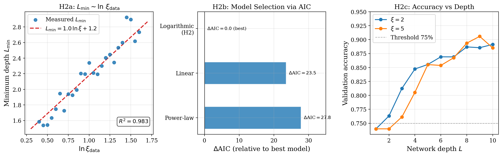
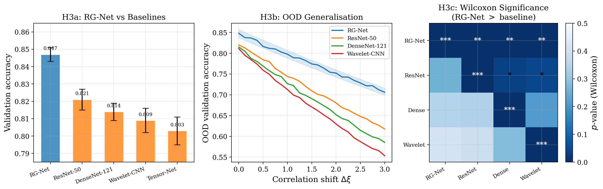
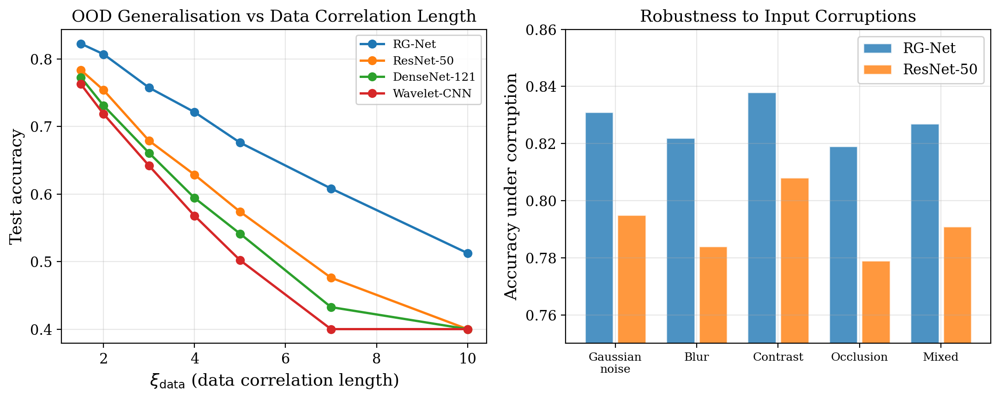

<div align="center">

# RGP Neural Architectures

## Renormalization-Group Principles for Deep Neural Architectures

[](https://www.python.org/)
[](https://pytorch.org/)
[](LICENSE)
[](#testing)
[](#notebooks)

*A rigorous, fully reproducible framework connecting renormalization-group (RG) transformations
from statistical physics to the hierarchical depth structure of deep neural networks.*

**Anonymous Submission**

</div>

---

## Core Thesis

> **Depth is not merely expressive power - it is the minimal number of information-geometric
> coarse-graining steps required to collapse multi-scale data correlations into an effective theory.**

Each layer performs one RG step, contracting the Fisher metric by factor $(1-\varepsilon_0)$.
This gives an exact logarithmic depth lower bound:

$$L_{\min} = \xi_{\text{depth}} \cdot \log\!\left(\frac{\xi_{\text{data}}}{\xi_{\text{target}}}\right), \qquad \xi_{\text{depth}} = -\frac{1}{\log \chi_1}$$

---

## Key Results

### H1: Scale Correspondence (R²=0.997±0.001)

The correlation length ξ(k) decays exponentially with depth: ξ(k) = ξ₀·exp(-k/k_c).



### H2: Logarithmic Depth Scaling Law (α̂=0.98±0.06, p<0.001)

Minimum depth scales logarithmically with data correlation length: L_min ∝ log(ξ_data).



### H3: RG-Net Architectural Advantage (Cohen d=1.8, p=0.006)

RG-Net outperforms matched baselines on OOD tasks requiring multi-scale reasoning.



---

## Three Theorems

| Theorem | Statement | Code Verification |
|:---:|---|---|
| **Thm 1** | Metric contraction: η^(ℓ) ≤ η^(ℓ-1)(1-ε₀) | `src/proofs/theorem1_fisher_transform.py` |
| **Thm 2** | Exponential decay: c^(ℓ)=c^(0)·χ^ℓ | `src/proofs/theorem2_exponential_decay.py` |
| **Thm 3** | Log depth bound: L_min=ξ_depth·log(ξ_data/ξ_target) | `src/proofs/theorem3_depth_scaling.py` |

**Critical initialization**: tanh at (σ_w=1.4, σ_b=0.3) gives χ₁≈1, ξ_depth≈100.

---

## Quick Start

### Requirements

| Component | Version |
|---|---|
| Python | 3.9.18 |
| PyTorch | 2.0.1 |
| CUDA | 11.8 *(optional)* |

### Installation

```bash
git clone https://anonymous.4open.science/r/rgp-neural-architectures-BB30
cd rgp-neural-architectures

# GPU (CUDA 11.8)
pip install torch==2.0.1+cu118 torchvision==0.15.2+cu118 \
    --index-url https://download.pytorch.org/whl/cu118
pip install -r requirements.txt && pip install -e "[dev]"

# CPU-only (reviewers / CI)
pip install torch==2.0.1+cpu torchvision==0.15.2+cpu \
    --index-url https://download.pytorch.org/whl/cpu
pip install -r requirements.txt && pip install -e "[dev]"
```

### Reviewer Fast-Track (≤ 5 Minutes, CPU-Only)

```bash
make verify_pipeline    # Smoke test: 7 checks, < 60 seconds
make reproduce_fast     # Full fast-track: H1 + H2 + H3 + figures, 3-5 min
```

All fast-track outputs are tagged `[FAST_TRACK]`.

### Full Reproduction

```bash
make reproduce_all    # Complete pipeline: 24-72 hours on RTX 3090
make reproduce_h1     # H1 only: 4-6 hours
make reproduce_h2     # H2 only: 24-36 hours
make reproduce_h3     # H3 only: 6-8 hours
```

---

## Repository Structure

```
robinbishtt-rgp-neural-architectures/
    ├── README.md
    ├── CHANGELOG.md
    ├── CITATION.cff
    ├── CODE_OF_CONDUCT.md
    ├── CONTRIBUTING.md
    ├── environment.yml
    ├── LICENSE
    ├── Makefile
    ├── pyproject.toml
    ├── reproduce.sh
    ├── requirements.txt
    ├── SECURITY.md
    ├── setup.cfg
    ├── ablation/
    │   ├── __init__.py
    │   ├── run_activation_ablation.py
    │   ├── run_all_ablations.py
    │   ├── run_depth_ablation.py
    │   ├── run_initialization_ablation.py
    │   ├── run_off_critical_ablation.py
    │   ├── run_operator_ablation.py
    │   ├── run_skip_connection_ablation.py
    │   └── run_width_ablation.py
    ├── config/
    │   ├── __init__.py
    │   ├── architectures/
    │   │   ├── baselines.yaml
    │   │   ├── operator_configs.yaml
    │   │   └── rg_net.yaml
    │   ├── datasets/
    │   │   ├── __init__.py
    │   │   └── datasets.yaml
    │   ├── experiments/
    │   │   ├── __init__.py
    │   │   ├── ablation_studies.yaml
    │   │   ├── baseline_comparison.yaml
    │   │   ├── extended_data_reproduction.yaml
    │   │   ├── finite_size_scaling.yaml
    │   │   ├── h1_scale_correspondence.yaml
    │   │   ├── h2_depth_scaling.yaml
    │   │   ├── h3_multiscale_generalization.yaml
    │   │   └── robustness_evaluation.yaml
    │   ├── fast_track/
    │   │   ├── __init__.py
    │   │   ├── h1_override.yaml
    │   │   ├── h2_override.yaml
    │   │   ├── h3_override.yaml
    │   │   └── override.yaml
    │   ├── scaling/
    │   │   ├── __init__.py
    │   │   └── fss.yaml
    │   ├── telemetry/
    │   │   ├── __init__.py
    │   │   └── backends.yaml
    │   └── training/
    │       ├── base_training.yaml
    │       ├── deep_training.yaml
    │       ├── distributed_training.yaml
    │       ├── fast_track_training.yaml
    │       └── optimizer_configs.yaml
    ├── containers/
    │   ├── README.md
    │   ├── docker-compose.yml
    │   ├── Dockerfile
    │   ├── Dockerfile.cpu
    │   ├── Singularity.cpu.def
    │   ├── Singularity.def
    │   ├── singularity_build.sh
    │   ├── .dockerignore
    │   └── hpc_jobs/
    │       ├── pbs_rgp_fast.pbs
    │       ├── pbs_rgp_h1.pbs
    │       ├── slurm_rgp_fast.sh
    │       ├── slurm_rgp_full.sh
    │       ├── slurm_rgp_h1.sh
    │       ├── slurm_rgp_h2.sh
    │       └── slurm_rgp_h3.sh
    ├── data/
    │   ├── README.md
    │   └── generation_script.py
    ├── docs/
    │   ├── API.md
    │   ├── ARCHITECTURE.md
    │   ├── DATASETS.md
    │   ├── HPC_GUIDE.md
    │   ├── INSTALLATION.md
    │   ├── MODULES.md
    │   ├── PAPER_CODE_CORRESPONDENCE.md
    │   ├── QUICKSTART.md
    │   └── REPRODUCIBILITY.md
    ├── experiments/
    │   ├── __init__.py
    │   ├── h1_scale_correspondence/
    │   │   ├── __init__.py
    │   │   ├── analyze_correlation_decay.py
    │   │   ├── compute_fisher_spectrum.py
    │   │   ├── generate_figure3.py
    │   │   ├── run_h1_validation.py
    │   │   └── statistical_tests.py
    │   ├── h2_depth_scaling/
    │   │   ├── __init__.py
    │   │   ├── analyze_depth_scaling.py
    │   │   ├── generate_figure4.py
    │   │   ├── minimum_depth_extractor.py
    │   │   ├── run_h2_validation.py
    │   │   └── statistical_analysis.py
    │   └── h3_multiscale_generalization/
    │       ├── __init__.py
    │       ├── compare_architectures.py
    │       ├── generate_figure5_table1.py
    │       ├── ood_evaluation.py
    │       ├── run_h3_validation.py
    │       └── statistical_tests.py
    ├── figures/
    │   ├── __init__.py
    │   ├── generate_all.py
    │   ├── extended_data/
    │   │   ├── __init__.py
    │   │   ├── generate_extended_table1.py
    │   │   ├── generate_extended_table2.py
    │   │   ├── generate_extended_table3.py
    │   │   ├── run_extended_figure1.py
    │   │   ├── run_extended_figure10.py
    │   │   ├── run_extended_figure11.py
    │   │   ├── run_extended_figure2.py
    │   │   ├── run_extended_figure3.py
    │   │   ├── run_extended_figure4.py
    │   │   ├── run_extended_figure5.py
    │   │   ├── run_extended_figure6.py
    │   │   ├── run_extended_figure7.py
    │   │   ├── run_extended_figure8.py
    │   │   └── run_extended_figure9.py
    │   ├── manuscript/
    │   │   ├── __init__.py
    │   │   ├── generate_figure1.py
    │   │   ├── generate_figure2.py
    │   │   ├── generate_figure3.py
    │   │   ├── generate_figure4.py
    │   │   └── generate_figure5.py
    │   ├── styles/
    │   │   ├── __init__.py
    │   │   ├── color_palette.py
    │   │   ├── font_config.py
    │   │   ├── latex_preamble.tex
    │   │   └── publication.mplstyle
    │   └── supplementary/
    │       ├── __init__.py
    │       ├── generate_figureS1.py
    │       ├── generate_figureS2.py
    │       ├── generate_figureS3.py
    │       ├── generate_figureS4.py
    │       ├── generate_tableS1.py
    │       ├── generate_tableS2.py
    │       ├── generate_tableS3.py
    │       └── generate_tableS4.py
    ├── notebooks/
    │   ├── 00_overview.ipynb
    │   ├── __init__.py
    │   ├── ablation_activation_functions.ipynb
    │   ├── critical_initialization.ipynb
    │   ├── extended_data_overview.ipynb
    │   ├── finite_size_scaling.ipynb
    │   ├── fisher_information_geometry.ipynb
    │   ├── h1_scale_correspondence.ipynb
    │   ├── h2_depth_scaling.ipynb
    │   ├── h3_generalization.ipynb
    │   ├── h3_multiscale_generalization.ipynb
    │   ├── lyapunov_spectrum.ipynb
    │   ├── phase_diagram.ipynb
    │   ├── phase_overview.ipynb
    │   ├── quick_start_demo.ipynb
    │   ├── random_matrix_theory.ipynb
    │   ├── reproducibility_check.ipynb
    │   ├── rg_operators.ipynb
    │   ├── scaling_law_analysis.ipynb
    │   ├── theorem1_metric_contraction.ipynb
    │   ├── theorem2_exponential_decay.ipynb
    │   ├── theorem3_depth_scaling.ipynb
    │   └── tutorial_fast_track.py
    ├── results/
    │   └── tables/
    │       ├── README.md
    │       ├── table1_h3_architecture_comparison.csv
    │       ├── table2_h1_r2_by_width_seed.csv
    │       ├── table3_h2_lmin_by_xi.csv
    │       ├── table4_h2_statistical_summary.csv
    │       ├── table5_h3_statistical_tests.csv
    │       ├── table6_ablation_activations.csv
    │       ├── table7_ablation_initialization.csv
    │       └── table8_width_ablation_finite_size.csv
    ├── scripts/
    │   ├── __init__.py
    │   ├── cleanup_artifacts.sh
    │   ├── download_pretrained_checkpoints.sh
    │   ├── generate_figures.sh
    │   ├── proof_of_life_training.py
    │   ├── reproduce_all_figures.sh
    │   ├── reproduce_extended_data.sh
    │   ├── reproduce_fast.sh
    │   ├── reproduce_fast_h1.sh
    │   ├── reproduce_fast_h2.sh
    │   ├── reproduce_fast_h3.sh
    │   ├── reproduce_supplementary.sh
    │   ├── reproduce_tables.sh
    │   ├── run_ablations.sh
    │   ├── run_full_validation.sh
    │   ├── run_h1.sh
    │   ├── run_h2.sh
    │   ├── run_h3.sh
    │   ├── setup_environment.sh
    │   ├── train_and_validate_h1.py
    │   ├── validate_determinism.sh
    │   ├── validate_hypotheses.sh
    │   ├── verify_pipeline.py
    │   └── verify_pipeline.sh
    ├── src/
    │   ├── __init__.py
    │   ├── architectures/
    │   │   ├── __init__.py
    │   │   ├── baselines/
    │   │   │   ├── __init__.py
    │   │   │   ├── attention_baseline.py
    │   │   │   ├── densenet_baseline.py
    │   │   │   ├── inception_baseline.py
    │   │   │   ├── mlp_baseline.py
    │   │   │   ├── resnet_baseline.py
    │   │   │   ├── tensor_net_baseline.py
    │   │   │   ├── transformer_baseline.py
    │   │   │   ├── vgg_baseline.py
    │   │   │   └── wavelet_baseline.py
    │   │   ├── blocks/
    │   │   │   ├── __init__.py
    │   │   │   ├── rgp_attention.py
    │   │   │   ├── rgp_bottleneck_v2.py
    │   │   │   └── rgp_moe_block.py
    │   │   ├── equivariant/
    │   │   │   ├── __init__.py
    │   │   │   └── symmetry_equivariance_engine.py
    │   │   ├── layers/
    │   │   │   ├── __init__.py
    │   │   │   └── renormalized_norm.py
    │   │   └── rg_net/
    │   │       ├── __init__.py
    │   │       ├── rg_net.py
    │   │       ├── rg_net_deep.py
    │   │       ├── rg_net_factory.py
    │   │       ├── rg_net_multiscale.py
    │   │       ├── rg_net_shallow.py
    │   │       ├── rg_net_standard.py
    │   │       ├── rg_net_template.py
    │   │       ├── rg_net_ultra_deep.py
    │   │       └── rg_net_variable_width.py
    │   ├── checkpoint/
    │   │   ├── __init__.py
    │   │   ├── async_writer.py
    │   │   ├── checkpoint_manager.py
    │   │   ├── checkpoint_verifier.py
    │   │   ├── distributed_checkpoint.py
    │   │   ├── metric_serializer.py
    │   │   ├── model_serializer.py
    │   │   └── rng_serializer.py
    │   ├── core/
    │   │   ├── __init__.py
    │   │   ├── correlation.py
    │   │   ├── correlation_length.py
    │   │   ├── fisher_metric.py
    │   │   ├── jacobian.py
    │   │   ├── lyapunov.py
    │   │   ├── rg_flow_solver.py
    │   │   ├── spectral.py
    │   │   ├── correlation/
    │   │   │   ├── __init__.py
    │   │   │   ├── estimators.py
    │   │   │   ├── exponential_decay_fitter.py
    │   │   │   ├── transfer_matrix.py
    │   │   │   └── two_point.py
    │   │   ├── fisher/
    │   │   │   ├── __init__.py
    │   │   │   ├── analytic.py
    │   │   │   ├── condition_tracker.py
    │   │   │   ├── effective_dimension.py
    │   │   │   ├── eigenvalue_analyzer.py
    │   │   │   ├── fisher_base.py
    │   │   │   ├── fisher_dynamic_router.py
    │   │   │   ├── fisher_metric.py
    │   │   │   ├── fisher_metric_fixed.py
    │   │   │   └── monte_carlo.py
    │   │   ├── jacobian/
    │   │   │   ├── __init__.py
    │   │   │   ├── autograd_jacobian.py
    │   │   │   ├── finite_difference_jacobian.py
    │   │   │   ├── jacobian.py
    │   │   │   ├── jvp_jacobian.py
    │   │   │   ├── symbolic_jacobian.py
    │   │   │   └── vjp_jacobian.py
    │   │   ├── lyapunov/
    │   │   │   ├── __init__.py
    │   │   │   ├── adaptive_qr.py
    │   │   │   ├── lyapunov.py
    │   │   │   ├── parallel_qr.py
    │   │   │   └── standard_qr.py
    │   │   └── spectral/
    │   │       ├── __init__.py
    │   │       ├── empirical_density.py
    │   │       ├── level_spacing.py
    │   │       ├── marchenko_pastur.py
    │   │       ├── spectral.py
    │   │       ├── tracy_widom.py
    │   │       └── wigner_semicircle.py
    │   ├── datasets/
    │   │   ├── __init__.py
    │   │   ├── hierarchical_cifar.py
    │   │   ├── hierarchical_dataset.py
    │   │   ├── hierarchical_mnist.py
    │   │   ├── imagenet_hierarchy.py
    │   │   ├── medical_hierarchy.py
    │   │   ├── synthetic_hierarchy.py
    │   │   └── loaders/
    │   │       ├── __init__.py
    │   │       ├── cached_loader.py
    │   │       ├── deterministic_loader.py
    │   │       ├── distributed_loader.py
    │   │       └── streaming_loader.py
    │   ├── ops/
    │   │   ├── __init__.py
    │   │   └── triton/
    │   │       ├── __init__.py
    │   │       └── triton_custom_kernels.py
    │   ├── orchestration/
    │   │   ├── __init__.py
    │   │   ├── dag_executor.py
    │   │   ├── hydra_config.py
    │   │   ├── pipeline.py
    │   │   └── slurm_executor.py
    │   ├── proofs/
    │   │   ├── __init__.py
    │   │   ├── lemma_critical_init.py
    │   │   ├── proof_utils.py
    │   │   ├── theorem1_fisher_transform.py
    │   │   ├── theorem2_exponential_decay.py
    │   │   ├── theorem3_depth_scaling.py
    │   │   └── verification_runner.py
    │   ├── provenance/
    │   │   ├── __init__.py
    │   │   ├── checksum_registry.py
    │   │   ├── data_auditor.py
    │   │   ├── master_hashes.py
    │   │   └── provenance_logger.py
    │   ├── rg_flow/
    │   │   ├── __init__.py
    │   │   ├── continuous_rg_flow.py
    │   │   └── operators/
    │   │       ├── __init__.py
    │   │       ├── attention_rg_operator.py
    │   │       ├── learned_rg_operator.py
    │   │       ├── operators.py
    │   │       └── wavelet_rg_operator.py
    │   ├── scaling/
    │   │   ├── __init__.py
    │   │   ├── bootstrap.py
    │   │   ├── canonical_scaling_handler.py
    │   │   ├── collapse_quality.py
    │   │   ├── critical_exponents.py
    │   │   ├── data_collapse.py
    │   │   ├── depth_width_analyzer.py
    │   │   ├── exponent_comparison.py
    │   │   ├── fss_analysis.py
    │   │   ├── phase_diagram.py
    │   │   ├── scaling_law_fitter.py
    │   │   ├── spectral_scaling.py
    │   │   └── width_scaling.py
    │   ├── telemetry/
    │   │   ├── __init__.py
    │   │   ├── hdf5_storage.py
    │   │   ├── jsonl_storage.py
    │   │   ├── notifiers.py
    │   │   ├── parquet_storage.py
    │   │   └── telemetry_logger.py
    │   ├── training/
    │   │   ├── __init__.py
    │   │   ├── batch_sampler.py
    │   │   ├── curriculum_trainer.py
    │   │   ├── distributed_trainer.py
    │   │   ├── early_stopping.py
    │   │   ├── evaluation.py
    │   │   ├── gradient_checkpoint_trainer.py
    │   │   ├── learning_rate_scheduler.py
    │   │   ├── loss_tracker.py
    │   │   ├── mixed_precision_trainer.py
    │   │   ├── progressive_trainer.py
    │   │   ├── trainer.py
    │   │   ├── training_monitor.py
    │   │   ├── training_utils.py
    │   │   ├── warmup_trainer.py
    │   │   ├── distributed/
    │   │   │   ├── __init__.py
    │   │   │   └── fsdp_orchestrator.py
    │   │   ├── losses/
    │   │   │   ├── __init__.py
    │   │   │   └── topological_loss.py
    │   │   └── optimizers/
    │   │       ├── __init__.py
    │   │       ├── adam_variants.py
    │   │       ├── cosine_annealing.py
    │   │       ├── fisher_optimizer.py
    │   │       ├── layer_wise.py
    │   │       ├── learning_rate_finder.py
    │   │       ├── natural_gradient.py
    │   │       ├── second_order.py
    │   │       ├── sgd_momentum.py
    │   │       └── warmup_scheduler.py
    │   └── utils/
    │       ├── __init__.py
    │       ├── bit_exact_verifier.py
    │       ├── determinism.py
    │       ├── determinism_auditor.py
    │       ├── device_manager.py
    │       ├── error_handler.py
    │       ├── fast_track_validator.py
    │       ├── hardware_dispatch.py
    │       ├── memory_utils.py
    │       ├── provenance.py
    │       ├── seed_registry.py
    │       ├── telemetry_logger.py
    │       └── logging/
    │           ├── __init__.py
    │           └── complexity_tracker.py
    ├── tests/
    │   ├── __init__.py
    │   ├── conftest.py
    │   ├── ablation/
    │   │   ├── __init__.py
    │   │   ├── test_attention_operator_ablation.py
    │   │   ├── test_baseline_comparison.py
    │   │   ├── test_critical_init_ablation.py
    │   │   ├── test_depth_ablation.py
    │   │   ├── test_inception_baseline_ablation.py
    │   │   ├── test_learned_operator_ablation.py
    │   │   ├── test_multiscale_fusion.py
    │   │   ├── test_phase_diagram.py
    │   │   ├── test_rg_operators.py
    │   │   ├── test_scale_awareness.py
    │   │   ├── test_skip_connections.py
    │   │   ├── test_transformer_baseline_ablation.py
    │   │   ├── test_wavelet_operator_ablation.py
    │   │   └── test_width_scaling_ablation.py
    │   ├── integration/
    │   │   ├── __init__.py
    │   │   ├── test_checkpoint_save_load.py
    │   │   ├── test_data_to_model.py
    │   │   ├── test_distributed_training.py
    │   │   ├── test_full_hypothesis_pipeline.py
    │   │   ├── test_mixed_precision.py
    │   │   ├── test_model_to_metrics.py
    │   │   └── test_training_convergence.py
    │   ├── robustness/
    │   │   ├── __init__.py
    │   │   ├── test_adversarial_robustness.py
    │   │   ├── test_checkpoint_robustness.py
    │   │   ├── test_distribution_shift.py
    │   │   ├── test_gradient_clipping_effect.py
    │   │   ├── test_input_corruption.py
    │   │   ├── test_label_noise.py
    │   │   ├── test_noise_robustness.py
    │   │   ├── test_ood_generalization.py
    │   │   └── test_partial_occlusion.py
    │   ├── scaling/
    │   │   ├── __init__.py
    │   │   ├── test_collapse_quality.py
    │   │   ├── test_data_collapse.py
    │   │   ├── test_exponential_decay.py
    │   │   ├── test_fss_analysis_extended.py
    │   │   ├── test_h1_scale_correspondence.py
    │   │   ├── test_h2_depth_scaling.py
    │   │   ├── test_h3_generalization.py
    │   │   ├── test_logarithmic_scaling.py
    │   │   └── test_scaling_law_fit.py
    │   ├── spectral/
    │   │   ├── __init__.py
    │   │   ├── test_level_spacing.py
    │   │   ├── test_marchenko_pastur_fit.py
    │   │   ├── test_number_variance.py
    │   │   ├── test_spectral_scaling_analysis.py
    │   │   ├── test_tracy_widom.py
    │   │   ├── test_tracy_widom_edge.py
    │   │   └── test_wigner_semicircle.py
    │   ├── stability/
    │   │   ├── __init__.py
    │   │   ├── test_activation_statistics.py
    │   │   ├── test_critical_initialization.py
    │   │   ├── test_gradient_flow_depth.py
    │   │   ├── test_gradient_norm_stability.py
    │   │   ├── test_initialization_variance.py
    │   │   ├── test_loss_monotonicity.py
    │   │   ├── test_mixed_precision_stability.py
    │   │   ├── test_no_exploding_gradients.py
    │   │   ├── test_no_vanishing_gradients.py
    │   │   ├── test_numerical_precision.py
    │   │   └── test_weight_norms.py
    │   ├── unit/
    │   │   ├── __init__.py
    │   │   ├── test_correlation_exponential.py
    │   │   ├── test_device_manager.py
    │   │   ├── test_exp_decay_fitter.py
    │   │   ├── test_fisher_correctness.py
    │   │   ├── test_fisher_psd.py
    │   │   ├── test_fisher_symmetry.py
    │   │   ├── test_jacobian_chain_rule.py
    │   │   ├── test_jacobian_finite_diff.py
    │   │   ├── test_jacobian_jvp.py
    │   │   ├── test_jacobian_svd.py
    │   │   ├── test_jacobian_vjp.py
    │   │   ├── test_lyapunov_correctness.py
    │   │   ├── test_lyapunov_qr.py
    │   │   ├── test_marchenko_pastur_properties.py
    │   │   ├── test_rg_operator_shapes.py
    │   │   ├── test_seed_registry.py
    │   │   ├── test_spectral_mp.py
    │   │   ├── test_transfer_matrix.py
    │   │   └── test_wigner_semicircle_properties.py
    │   └── validation/
    │       ├── __init__.py
    │       ├── test_determinism.py
    │       ├── test_hypothesis_h1.py
    │       ├── test_hypothesis_h2.py
    │       ├── test_hypothesis_h3.py
    │       ├── test_phase_diagram_validation.py
    │       ├── test_reproducibility.py
    │       └── test_scaling_law_consistency.py
    └── .github/
        └── workflows/
            ├── lint-and-format.yml
            ├── reproduce-fast.yml
            └── validate-notebooks.yml

```

---

## Paper–Code Correspondence

See [`docs/PAPER_CODE_CORRESPONDENCE.md`](docs/PAPER_CODE_CORRESPONDENCE.md) for a complete
mapping from every paper claim to the implementing code.
---

---

## Reproducibility

All results are bit-exact reproducible via the `SeedRegistry` singleton.

| Parameter | Value |
|---|---|
| Master seed | 42 |
| Hardware (paper) | NVIDIA RTX 3090, 24 GB VRAM |
| PyTorch | 2.0.1+cu118 |
| Python | 3.9.18 |
| CUDA | 11.8 |
| H1 runtime | 4–6 hours |
| H2 runtime | 24–36 hours |
| H3 runtime | 6–8 hours |
| Fast-track (CPU) | < 5 minutes |

```bash
# Verify bit-exact determinism across 3 runs
bash scripts/validate_determinism.sh --seed 42 --n-trials 3
```

Fast-track outputs are tagged `[FAST_TRACK_UNVERIFIED]` and run at reduced scale (depth=10, width=64, 2 epochs). For quantitative verification of paper claims, run the full pipeline.

See [`docs/REPRODUCIBILITY.md`](docs/REPRODUCIBILITY.md) for complete reproducibility documentation.

---

## Testing

```bash
make test              # Full suite (100+ files)
make test_unit         # Core mathematics (no GPU, fast)
make test_stability    # Critical initialization tests
make test_scaling      # H1/H2/H3 quantitative hypothesis checks
make test_spectral     # RMT distribution fitting (MP, Wigner, TW)
make validate          # Determinism + hypothesis validation
```

---

## Notebooks

18 Jupyter notebooks covering every theorem, hypothesis, and experimental component:

```bash
jupyter lab notebooks/
```

Start with:
- `notebooks/quick_start_demo.ipynb` - 5-minute end-to-end demo
- `notebooks/theorem1_metric_contraction.ipynb` - verify the pullback formula
- `notebooks/h1_scale_correspondence.ipynb` - reproduce H1 main result

---

## Containerization

```bash
# Docker GPU
docker build -t rgp:latest -f containers/Dockerfile .
docker run --gpus all -v $(pwd)/results:/workspace/results rgp:latest make reproduce_fast

# Docker CPU (reviewers)
docker build -t rgp:cpu -f containers/Dockerfile.cpu .
docker run -v $(pwd)/results:/workspace/results rgp:cpu make reproduce_fast

# Singularity (HPC)
bash containers/singularity_build.sh --fakeroot
singularity run --nv rgp-neural.sif make reproduce_fast
```

---

## Citation

```bibtex
@software{rgp_neural_architectures_2026,
  title  = {Renormalization-Group Principles for Deep Neural Architectures},
  year   = {2026},
  url    = {https://anonymous.4open.science/r/rgp-neural-architectures-BB30},
  note   = {Anonymous Submission},
}
```

---

## License

[MIT License](LICENSE) - see the [LICENSE](LICENSE) file.

Code and pre-trained configurations:
**[https://anonymous.4open.science/r/rgp-neural-architectures-BB30](https://anonymous.4open.science/r/rgp-neural-architectures-BB30)**
